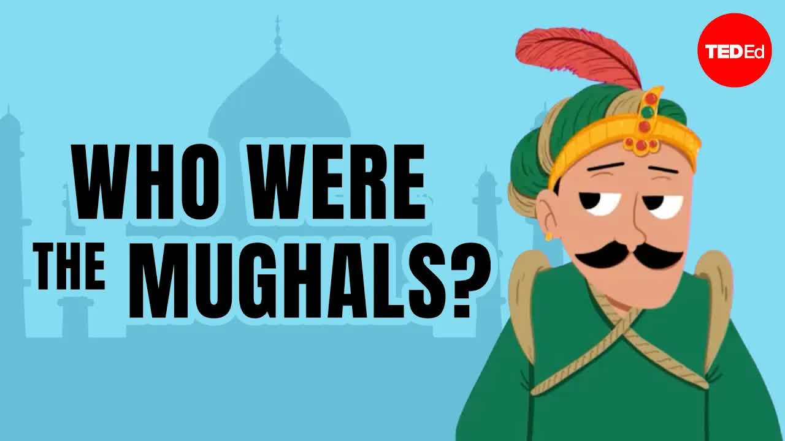

# The-rise-and-fall-of-the-Mughal-Empire-Stephanie-Honchell-Smith

  <picture>
    
  </picture>

 

---

## Video Information

| Property | Value |
|----------|-------|
| **Video Name** | `The-rise-and-fall-of-the-Mughal-Empire-Stephanie-Honchell-Smith` |
| **Original Link** | [YouTube Video](https://www.youtube.com/watch?v=fMsmCxIEQr4) |
| **Total Size** | **1 file** (no split) - **9.54 MB** |
| **Quality** | **best** |
| **Status** | **Complete (100%)** |
| **Password Protected** | **NO** |

---

---

## 🔤 Subtitles

| # | File | Link |
|---|------|------|
| 1 | `subtitle.zip` | [Download](subtitle.zip) |

> Contains all available subtitle languages. Extract to get `.vtt` files.

## Download Link

| # | File | Link |
|---|------|------|
| 1 | `The-rise-and-fall-of-the-Mughal-Empire-Stephanie-Honchell-Smith_omega_9492.mp4` | [Download](The-rise-and-fall-of-the-Mughal-Empire-Stephanie-Honchell-Smith_omega_9492.mp4) |

---

Ready to use — no extraction needed!

---

*This tool created by [avasam.ir](https://avasam.ir)*
